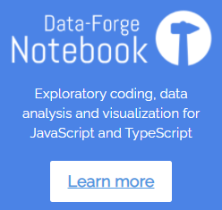
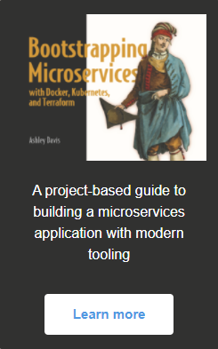
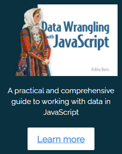

Welcome to the personal web site of **Ashley Davis**. 

Software craftsman, technologist, author, CTO of [Sortal](https://www.sortal.io), creator of [Data-Forge Notebook](https://github.com/data-forge-notebook/datakit) and algorithmic trader.

I'm available for consulting and contracting, <a href="#contact">please see my contact details</a>.

[Follow me on Twitter](https://twitter.com/ashleydavis75)

<a href="#support-my-work">See how you can **support my work.**</a>

  

# Consulting / Contracting

I'm available for consulting and contracting work.

I can you help with the following:

- Bootstrapping your microservices application and development process
- Moving from monolithic application structure to microservices
- Recruiting and coaching/training your development team
- Setup for fast and reliable automated software deployment and testing (continuous delivery)
- Fullstack JavaScript development (Browser, Node.js, Ionic and Electron)
- Data analysis, visualization and pipelines

<a href="#contact">Please reach out to me</a>

# Bootstrapping Microservices

My new book, Bootstrapping Microservices with Docker, Kubernetes and Terraform, is a practical and project-based guide to building distributed applications with microservices.

The <a href="http://bit.ly/2o0aDsP" target="_blank">early access program for Bootstrapping Microservices</a> has started. This is your opportunity to support this new book at an early stage. Get the chapters as they are published and give feedback that can influence the direction of the book as it is developed!

# Data Wrangling with JavaScript

My first book [Data Wrangling with JavaScript](http://bit.ly/2t2cJu2) is a comprehensive overview of working with data in JavaScript. Please let your friends and collegues know about it!

# Data-Forge and Data-Forge Notebook

[Data-Forge](http://www.data-forge-js.com) is my open-source data transformation and analysis toolkit for JavaScript/TypeScript. It is inspired by Pandas and LINQ and is my goto tool for slicing and dicing data. 

[Data-Forge Notebook](http://data-forge-notebook.com/) is my notebook-style desktop app for data analysis, transformation and visualization in JavaScript and TypeScript (kind of like an IDE for working with data). Delivered to 100+ customers on Windows, MacOS and Linux. My first indie application! [Check out the video](https://www.youtube.com/watch?v=HO1J1G_A3d8).

# Public speaking

In January 2020 I spoke at the [Microservices Conference](https://www.youtube.com/watch?v=4NciD9gV180&feature=youtu.be&t=4112) in Ankara, Turkey.

I'm a regular speaker at the Brisbane JavaScript meetup ([example](https://www.youtube.com/watch?v=rLzljZmdBNM&feature=youtu.be&t=913)), occasionally speak for other meetups and have spoken as a mentor at Coder Academy.

I also have a [YouTube channel that's mostly for Data-Forge Notebook](https://www.youtube.com/c/thedatawrangler).

# Bio

Most recently I have focused on building distributed applications with microservices running on Kubernetes, but I have a long history in software development with many years in apps, web apps, backends, serious games, simulations and VR. I make technology work for business. I architect and build bespoke software solutions that span multiple platforms.

I manage development teams, prepare technical strategies and architect software products. I explain complicated technology to senior management. I have delivered cutting-edge products in fast-paced and high-pressure environments. I know how to focus and prioritize to get the important things done. 

I am a passionate technologist and agile practitioner. I have had great success with TDD and am convinced of its ability to produce better code that stabilizes more quickly while being evolved rapidly. I'm a fan of functional programming principles and their potential for safety, predictability & concurrency. 

I contribute to open source and have founded multiple industry groups.

I'm also a keen algorithmic trader, currently trading stocks on the ASX.

[Please find me on LinkedIn](https://www.linkedin.com/in/ashleydavis75/) for my full history.

# Open-source

I have plenty of open-source code available on my [personal Github](https://github.com/ashleydavis), [the Data-Forge org](https://github.com/data-forge/), [the Grademark org](https://github.com/grademark/), [Task-Mule](https://github.com/task-mule/task-mule) and [MiniQL](https://github.com/miniql/miniql).

I also did open-source work while at Real Serious Games, you'll find some very useful code for working with Unity and Node.js on [the Real Serious Games Github org](https://github.com/real-serious-games).

# Quantitative and algorithmic trading

I'm a keen systematic trader, currently trading stocks on the ASX and exploring quantiative and algorithmic trading strategies.

I created a stock market simulator called [Market Wizard](https://www.market-wizard.com.au/) which has a small, but loyal following. 

These days I mostly test trading strategies through backtesting because papertrading is too slow. I have built extensive personal software for this purpose. I am slowly open-sourcing my backtesting code under [the Grademark org](https://github.com/grademark/). 

# Blogs

I have two blogs.

[The Data Wrangler](http://www.the-data-wrangler.com/) is my current blog - with writings on data analysis and general coding.

[What could possibly go wrong?](http://www.what-could-possibly-go-wrong.com/) is my older game tech blog, I no longer update this - but it's preserved for posterity and to occasionally remind myself of just much I have written.

# Industry groups

I founded [Game Dev Brisbane](https://www.meetup.com/Game-development-Brisbane/) and [Game Tech Brisbane](https://www.meetup.com/Game-Technology-Brisbane/) and continued to organise them for 5 years.

I organised [Brisbane Unity Developers](https://www.meetup.com/Brisbane-Unity-Developers/) for multiple years.

# Contact

Need help with something? 

Want to talk tech?

Please reach out.

- Twitter: @ashleydavis75
- Email: ashley@codecapers.com.au
- [LinkedIn profile](https://www.linkedin.com/in/ashleydavis75/)

# Support my work

You can support my work in any of the following ways:

- [Follow me on Twitter](https://twitter.com/ashleydavis75)
- Star my repositories on GitHub:
  - [Data-Forge](https://github.com/data-forge/data-forge-ts)
  - [Grademark](https://github.com/grademark/grademark)
  - [MiniQL](https://github.com/miniql/miniql)
  - [Plot](https://github.com/data-forge-notebook/plot)
  - [Datakit](https://github.com/data-forge-notebook/datakit)
- Share links to my work on Twitter and other social media.
- [Sponsor me on GitHub](https://github.com/sponsors/ashleydavis).
- Purchase [Data-Forge Notebook](https://www.data-forge-notebook.com/).
- Purchase either of my books [Data Wrangling with JavaScript](http://bit.ly/2t2cJu2) or [Bootstrapping Microservices](http://bit.ly/2o0aDsP).

    

    

    

